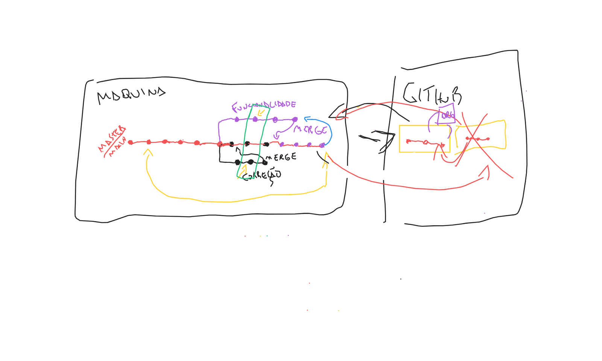

# XP-36
## Hackers

Eai, galerinha! Tudo bem?

Nessa página coloquei as respostas das perguntas no [OneAsk](https://oneask.app/e/xp36hacker/5fa06430d46eb9e5b7c9107a). No fim do conteúdo estou colocando a imagem daquele [WiteBoard](https://witeboard.com/) que a gente rabiscou sobre git/github, beleza?

Vocês podem me encontrar por ai na internet:

- Meu usuário nas redes sociais é `@gabrieluizramos` e no [meu site](http://gabrieluizramos.com.br/) estão todos os meus links também
- Fora isso, podemos nos adicionar [LinkedIn](https://www.linkedin.com/in/gabrieluizramos/) também

Tamo junto, bons estudos 🙌

---

1) Quando eu crio um repositório no github para trabalhar em equipe ou em algum projeto open source, existe alguma configuração para ser modificado no repositório?

R: Depende de cada caso. Geralmente, só adicionar as pessoas como colaboradoras no repositório é suficiente.

---

2) O eterno problema designer/desenvolvedor. Como melhor fazer essa ponte? O que o designer pode fazer e precisa pra ajudar o desenvolvedor e vise-versa?

R: Eu, particularmente, acho que apostando numa boa comunicação é sempre válido. Deixar a galera do design confortável para aprender e perguntar sobre desenvolvimento assim como deixar a galera de desenvolvimento confortável para aprender e perguntar sobre designer.

Sempre que participei desses cenários foi algo bem positivo, pois, além de aproximar "os dois mundos", as duas pessoas saiam aprendendo um pouco mais sobre o processo de trabalho da outra e também impactava significativamente a qualidade de um produto.

Já trabalhei com designers que não gostavam de desenvolvimento e tudo bem, assim como não é qualquer dev que gosta de design. Mas admito que a qualidade das entregas que tivemos quando essa curiosidade e esse papo existia era muito melhor! Chamávamos essas reuniões de `desgramming`, como se fosse um `pair programming` com `design`, rs.

Também comentamos sobre prazo nessa pergunta e, estimar prazos para desenvolvimento é sempre uma tarefa meio complicada. No entanto, é possível diminuir alguns atritos e tornar essas estimativas mais assertivas com algumas práticas e cerimônias de Scrum. Comentei com vocês que uma vez aplicamos uma regra baseada em valor de entrega para o usuário e o link dela pra quem quiser consultar é [esse aqui](https://www.notion.so/Novo-modelo-de-r-gua-de-pontua-o-por-valor-ao-inv-s-de-tempo-esfor-o-28eb265b14504f6780ba7cb0a66be6fe).

---

3) Tenho algumas perguntas, kk Como é o dia a dia dos DEV's ao iniciar os projetos? Como é feita a divisão das partes do front-end por exemplo.

R: Isso depende bastante do produto e do time. Às vezes um time fica responsável por uma tela inteira (ou por uma sequência de telas), ou por um produto todo, ou por apenas alguns componentes dentro de vários produtos.

Tudo muda muito de uma empresa pra outra e de um time pra outro. O importante é que todos tenham um alinhamento que estão exercendo papéis para melhorar e desenvolver um produto em comum.

---

4) Gostaria de dicas sobre responsividade (principalmente para compatibilizar com todas as telas mobile). Qual ferramenta vc usa e se vc segue algum padrão, e se der tempo mostrar exemplos :)

R: No geral, responsividade é feita, basicamente, utilizando as unidades de medida certas conforme as necessidades das suas interfaces. Você pode usar unidades como porcentagem (%), rem (unidade relativa ao `font-size` do elemento HTML), píxel (px) e valores relacionados à largura (vw) e altura (vh) da tela. Fora isso, através dos media-queries (aquelas consultas de mídia feitas no CSS começando com `@media` que vimos, lembram?) também podemos modificar algumas coisas conforme alguma regra de algum dispositivo.

Só temos que lembrar que muitos frameworks (como [Boostrap](https://getbootstrap.com/)) acabam entregando tudo isso de forma pronta, pra que a gente foque somente no desenvolvimento do produto em si. Então é sempre bom entendermos como fazer algo sem estar relacionado à algum framework ou implementação específica, somente com o bom e velho HTML, CSS e JS. Esse tipo de postura faz com que a gente fique menos dependente de alguma ferramenta e faz com que a gente aprende os fundamentos e como utilizar as tecnologias de forma mais eficiente.

---

5) Gostaria de saber mais sobre como medir e melhorar o desempenho do site, ferramentas e melhores práticas.

R: Existem várias formas de medir e melhora performance. Desde serviços como [PageSpeed Insights](https://developers.google.com/speed/pagespeed/insights/?hl=pt-br) (um dos serviços mais famosos que mede o carregamento de páginas), até a forma como desenvolvemos (utilizando métodos e abordagens que evitem retrabalho de processamento para o navegador) e disponibilizamos nosso código (HTML/CSS/JS, imagens e até o processamento que ocorre em um servidor) e políticas de Cache (aquela memória que comentamos) mais eficientes.

É um assunto bem extenso, por si só, justamente por ser possível aplicar em diferentes pontos de nossas aplicações.

---

### WiteBoard Git/Github
Aquele WiteBoard que fizemos. Sei que ficou meio confuso mas talvez ajude vocês caso precisem relembrar alguma coisa.

